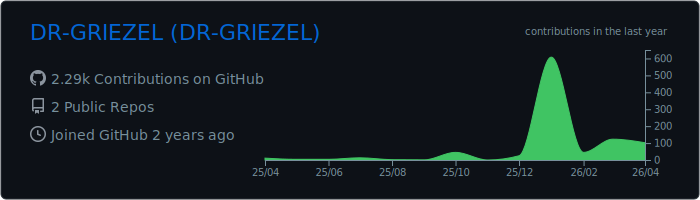
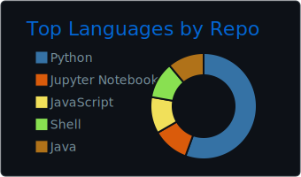

# DR_GRIEZEL

**Python** · **Linux** · **Git** · **CI/CD** · **API** · **Web** · **Bots**

<!--START_SECTION:waka-->
<!--END_SECTION:waka-->

---

## Currently working on
- **Bot API → GitHub Pages dashboard**
- **Discord bot UI** (market data / portfolio / alerts)

## Project status

| Project | Description | ✅ | Notes |
|---|---|---:|---|
| **Trading engine** | OHLCV → strategy → virtual portfolio tracking | 🟡 | Drawdown, risk caps, testability |
| **Auto-optimizer** | grid/random search over strategy params | 🟡 | Export to dashboard |
| **Monte Carlo robustness** | randomization for stress tests | 🟠 | MDD, ruin risk, tail events |
| **Discord API** | RSI/ATR, tickers, embeds | 🟡 | UX-first: less spam |
| **GitHub Pages** | static frontend with live updates | 🟠 | No secrets in the client |
| **Server** | self-hosted services, hardening | 🟢 | Backups, rollback |

Legend: 🟢 stable · 🟡 active · 🟠 in progress · 🔴 paused

---
